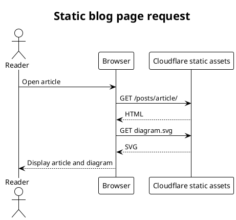

以下时序图描述一次静态博客访问。图表在本地生成，页面直接加载仓库中的 SVG。


```plantuml Browser requests a static blog page
@startuml
!theme plain
title Static blog page request
actor Reader as reader
participant Browser as browser
participant "Cloudflare static assets" as assets
reader -> browser: Open article
browser -> assets: GET /posts/article/
assets --> browser: HTML
browser -> assets: GET diagram.svg
assets --> browser: SVG
browser --> reader: Display article and diagram
@enduml
```

普通代码块仍然显示为代码：

```text
browser -> assets: GET /posts/article/
```
